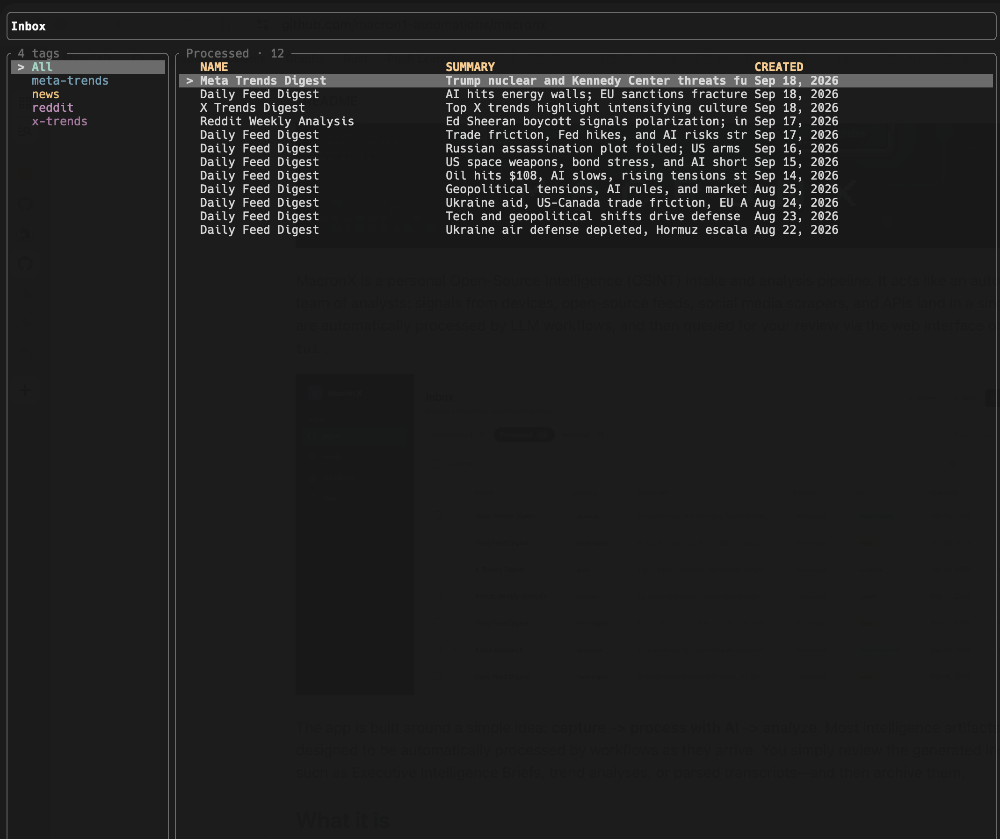
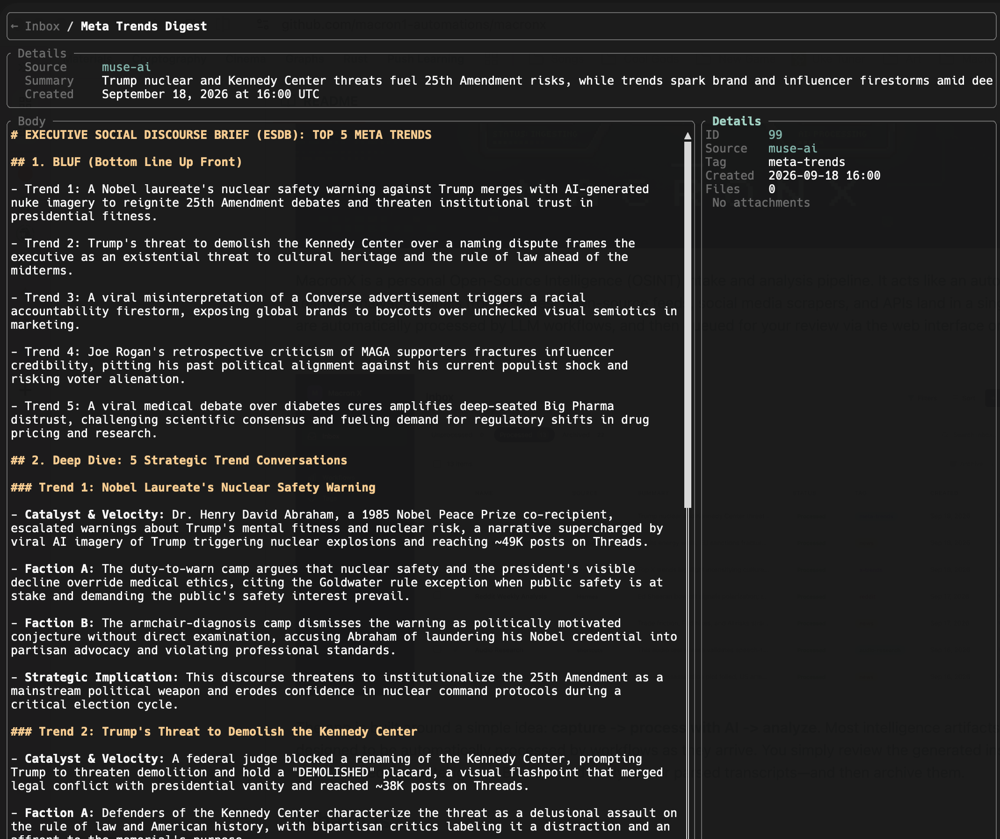

# macronx-tui


A fast, keyboard-driven terminal user interface for [MacronX](https://github.com/macron1-automations/macronx) — a personal Open-Source Intelligence (OSINT) intake and analysis pipeline.

MacronX aggregates intelligence signals across news feeds, social platforms, audio intercepts, and field imagery, synthesizing them via local LLM workflows into structured briefs. `macronx-tui` provides a rapid, distraction-free environment for analysts to review generated intelligence artifacts, inspect multimedia context, and triage inbox items entirely from the terminal.

## Screenshots
### Inbox View


### Detail View


## Key Features

- **Fast Inbox Triage & Tag Filtering**: Quickly navigate processed or archived inboxes, cycle through tags (`Shift+J` / `Shift+K`), and archive/unarchive (`a`) items with single keystrokes.
- **Executive Intelligence Briefs via Markdown**: Inspect synthesized reports, trend analyses, and transcripts rendered with width-aware word-wrapping and syntax highlighting.
- **Image Intelligence (IMINT) Inline Previews**: Lazily preview attached field photos, charts, and diagrams directly inside the terminal using native graphics protocols (Kitty, iTerm2, Sixel).
- **Audio Intercept Playback**: Play, pause, seek, and adjust volume on audio attachments with an interactive waveform overview and live level visualization without leaving the inbox.

## Requirements

- Rust 2021 toolchain
- A running [MacronX](https://github.com/macron1-automations/macronx) API
- `MACRONX_API_TOKEN` and `MACRONX_API_URL` set in your environment

## Usage

```sh
export MACRONX_API_URL=http://localhost:5000
export MACRONX_API_TOKEN=your-token

cargo run
```

## Controls

| Key | Action |
| --- | --- |
| `j` / `Down` | Move down |
| `k` / `Up` | Move up |
| `g` | Jump to first inbox |
| `G` | Jump to last inbox |
| `Shift+J` | Filter by next tag |
| `Shift+K` | Filter by previous tag |
| `Enter` | Open selected inbox |
| `a` | Archive/unarchive selected inbox |
| `r` | Refresh inboxes |
| `t` | Toggle between processed and archived views |
| `Esc` / `Backspace` | Return from detail screen |
| `j` / `Down` | Scroll body down (or move attachment selection when sidebar is focused) |
| `k` / `Up` | Scroll body up (or move attachment selection when sidebar is focused) |
| `PgUp` / `PgDn` | Scroll body by page |
| `g` | Scroll body to top |
| `G` | Scroll body to bottom |
| `Tab` | Toggle focus between body and sidebar |
| `u` | Toggle sidebar visibility |
| `o` | Open selected attachment with the system's default app |
| `space` | Play / pause attached audio |
| `←` / `→` | Seek audio ±5s |
| `+` / `-` | Audio volume |
| `q` | Quit |

## Detail View Sidebar

The detail view splits the body area into a main scrollable column (~80%) and a sidebar (~20%). The sidebar shows metadata fields — id, source, tag, creation time, and attachment count — with the attachments list rendered directly beneath them in the same pane:

- Attachment rows show a type tag (`[IMG]`, `[AUD]`, `[FILE]`) and size. Selecting an image lazily downloads and previews it inline; selecting an audio file shows an inline mini-player with elapsed/total time, a waveform overview with playhead, and a live level visualization. Only the selected attachment is downloaded, so the sidebar stays lazy.

Images render through native terminal graphics protocols (Kitty, iTerm2, Sixel) via `ratatui-image`, falling back to unicode halfblocks on terminals without graphics support.

### Inline Audio Playback

Pressing `space` anywhere in the detail view plays/pauses the attached audio via `rodio`. While playing, `←`/`→` seek ±5 seconds and `+`/`-` adjust volume. Playback continues while browsing tabs and stops when leaving the inbox.

## Body Markdown Rendering

The detail screen renders the inbox body with a small, dependency-free markdown parser (`src/ui/inbox_show.rs`). It is intentionally light and covers the common cases:

- **Headings** — lines starting with `#` (optionally indented) render bold and yellow.
- **Fenced code blocks** — lines between ` ``` ` or `~~~` fences render green. `**` inside code is treated literally, so markup stays readable.
- **Blockquotes** — lines starting with `>` render blue.
- **Inline bold** — text wrapped in `**…**` renders bold and the `**` markers are removed, e.g. `this is **important**` shows as: this is **important**.
- **Everything else** — plain white text.

Inline `**` is parsed before word-wrapping, so an emphasized phrase that wraps across two rows stays bold with no markers reappearing at the seam. An unmatched `**` (no closing pair on the same line) is shown literally. The raw `#`, `>`, and fence markers stay visible; only `**` is stripped.

Word-wrapping is width-aware (via `unicode-width`), and the body scrolls vertically with `j`/`k`, `PgUp`/`PgDn`, and `g`/`G`.

## Terminal Performance

The interface is built to feel fast. For the best experience, use a modern GPU-rendered terminal such as [Ghostty](https://ghostty.org/), especially when working with large inbox lists or dense JSON payloads.

## Configuration

`macronx-tui` reads configuration from environment variables:

| Variable | Required | Default | Description |
| --- | --- | --- | --- |
| `MACRONX_API_TOKEN` | Yes | none | Bearer token sent to the Macronx API |
| `MACRONX_API_URL` | No | `http://localhost:5000` | Base URL for the Macronx API |

## Related Documentation

- **[MacronX Backend Repository](https://github.com/macron1-automations/macronx)**: The primary intake and analysis pipeline.
- **[Setup & Configuration](https://github.com/macron1-automations/macronx/blob/main/docs/SETUP.md)**: Local development, LLM configuration, database setup, and security notes.
- **[Daily RSS Feed Digest](https://github.com/macron1-automations/macronx/blob/main/docs/RSS_FEEDS.md)**: Digest schedules and automated news analysis workflows.
- **[Audio Transcription](https://github.com/macron1-automations/macronx/blob/main/docs/AUDIO_TRANSCRIPTS.md)**: Supported audio formats and automated Whisper transcription.
- **[API Ingestion](https://github.com/macron1-automations/macronx/blob/main/docs/API.md)**: API endpoints, payload structures, and ingestion tokens.
